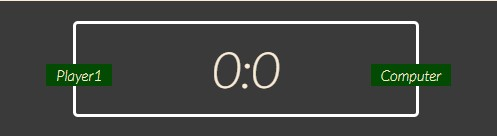

# The RPS Game - A Rock Paper Scissors game.

For the second assignment with the Code Institute, I have created a classic version of the Rock Paper Scissors game. The game is single player only and the user will try gather as many points as possible. The user will have three choices while the computers will be randomly assigned. 

The rules of the game are the same as the original ; Rock beats scissors. Scissors beat paper, and paper beats rock. The game is kept easy, simple and fun.

The main target of the site is people who just want to have a bit of fun or maybe explore some simple JavaScript. 

[View my game here](https://aodhank25.github.io/The-RPS-Game/)

## User Experience (UX)

 - ### User stories
  #### Site Visitor Goals
 - As  Site  Visitor , I want the game to be easily understandable
 - As  Site  Visitor,  I want to easily know the score 
 - As  Site  Visitor, I want to understand the rules 
 - As  Site  Visitor, play the game because I am having fun 
 - As  Site  Visitor

## Features

The features on the site are relatively simple to keep the users experience simple and fun. Some features are, 

 1. Header - this show the important name of the game. 
 2. The game buttons - These allow the user to select their move and turn black when hovered over to show which move is being selected. 

 

 3. Scoreboard - These allows the user to keep track of the score. Both the user and computer start off at 0 all. 

 
 
 4. Tag line - this allows the user to see what moves they and they computer have selected. This will show the winner and their moves. 

 

 ## Technologies Used
 - HTML5
 - CSS 
 - JavaScript 
 - FontAwsome 
 - Google Fonts 
 - Git Hub 

## Testing

- The game was tested in both windows explorer and google chrome. 
- ### Validator Testing

-  The W3C Markup Validator and W3C CSS Validator Services were used to validate all pages of the project to ensure there were no syntax errors in there.
- JSHint was used to validate the JavaScript with no errors highlighted.

## Deployment
-   The site was deployed to GitHub pages. The steps to deploy are as follows:
    -   Log in to GitHub and locate the GitHub Repository.
    -   In the GitHub repository, navigate to the "Settings" tab.
    -   In Settings, choose "Pages" from the left hand menu.
    -   Under "Source", select branch "Main" and select folder "(Root)".
    -   Click Save and the page will be automatically refreshed with a detailed ribbon display to indicate the successful deployment.

## Credits
- FreeCodeCamp - Tutorial on how to make a rock Paper Scissors game 
https://www.freecodecamp.org/news/web-development-tutorial-javascript-game/
- JavaScript plain English - Another tutorial on a different method of designing a rock paper scissors game  
- https://javascript.plainenglish.io/building-a-rock-paper-scissors-game-with-javascript-bce23d39509d
- JavaDebugger - for helping me fix my code 
https://www.onlinegdb.com/online_java_debugger
- Font Awsome for the game icons 
https://fontawesome.com/
- Google Fonts for the fonts used. 

And most importantly my ever patient Mentor for the ideas and guidance. 